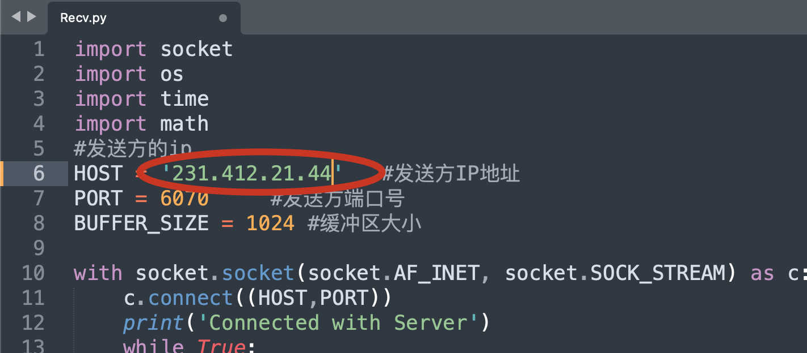
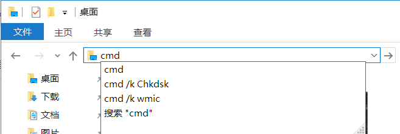

# FileSyn:文件同步脚本

## 简介

本脚本使用的是python语言编写，采用轮询检查的方式来同步源端文件夹到目的端。每隔15s源端处检查一次文件是否发生变化，并将增加的文件发送到目的处。*注意：源端处文件夹不可以进行同步*

若目的处已存在同名文件，则该文件会加入后缀："(1)"来区分。

端口号（PORT）可以自行更改，但请确保Send.py与Recv.py文件中的PORT相同


## 文件说明

- Send.py：发送端（同步源端）
- Recv.py：接收端（同步目标端）

## 使用说明（局域网版）

1. 将Send.py放到同步源端，将Recv.py放到同步目标端

2. 在终端使用python打开Send.py

   ```shell
   > python Send.py
   当前路径为： sended_dir
   ```

3. 查看源端计算机的ip，修改Recv.py的ip处，然后保存

   

4. 在同步目标端处打开终端

   Windows系统：打开同步目标端，在文件浏览器地址栏键入cmd，回车

   

​		Mac OS系统：打开terminal.app（终端），使用cd命令进入同步目标端（自行搜索）

5. 同步完成

## 使用说明（互联网版）

在互联网上传输需要使用到内网穿透工具，此次测试使用的工具为zerotier。官网：https://www.zerotier.com/

在zerotier建立网络后，使用得到的ip替换Recv.py中的ip即可，使用方法同局域网方法。

# FileSyn: File Sync Script

## Introduction

This script is written in python and uses polling checks to synchronize the source folder to the destination. Every 15s the source checks for file changes and sends the added files to the destination.*Note: Folders at the source side cannot be synchronized*

If a file with the same name already exists at the destination, the file is distinguished by adding the suffix: "(1)".

The port number (the variable: PORT) can be changed by yourself, but make sure that Send.py has the same PORT as in the Recv.py file

## File description

- Send.py: Sending side (sync source side)
- Recv.py: Receiver (sync target)

## Instructions for use (LAN version)

1. put Send.py to the sync source side and Recv.py to the sync target side

2. Open Send.py in terminal with python

   ```shell
   > python Send.py
   The current path is: sended_dir
   ```

3. Check the ip of the source computer, change the ip of Recv.py, and save

   

4. Open the terminal at the sync target

   Windows system: open the sync target, type cmd in the file browser address bar, enter

   

Mac OS system: open terminal.app (terminal) and use the cd command to enter the sync target (search by yourself)

5. Synchronization completed

## Instructions for use (Internet version)

Transmission over the Internet requires the use of intranet penetration tools, the tool used in this test is zerotier. official website: https://www.zerotier.com/

After establishing network in zerotier, use the obtained ip to replace the ip in Recv.py, use the same method as LAN method.

Translated with www.DeepL.com/Translator (free version)
